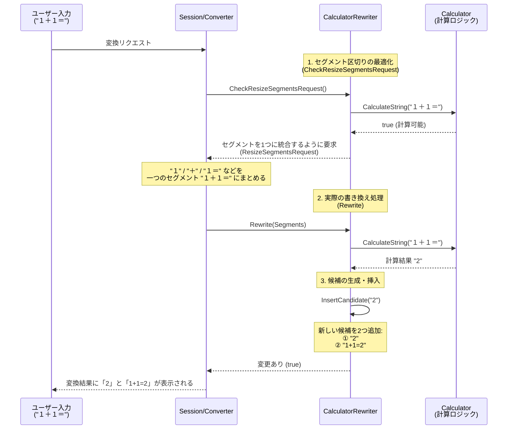

# CalculatorRewriter 解説

このドキュメントでは、Mozcにおける `calculator_rewriter` の仕組みと実装について初学者向けに詳しく解説します。この機能は、ユーザーが数式（「1+1=」など）を入力して変換した際に、その計算結果（「2」）を変換候補として表示する「電卓機能」を提供しています。

## 1. `calculator_rewriter` とは？

日本語入力中に簡単な計算を行いたい場合の便利機能です。
ユーザーが「１２３＊４５＝」と入力して変換キーを押した際、それを数式として評価し、その計算結果である「5535」や式付きの「123*45=5535」といった候補を作り出し、一番上にサジェストします。

## 2. システム全体の流れ

ユーザーが数式を入力した際、どのようにして計算結果が変換候補に現れるのかを視覚化します。



## 3. 各ファイルの役割と主要関数の解説

### 1) `rewriter/calculator/calculator.h`, `calculator.cc`
実際の四則演算やパース（構文解析）を行う計算機の実体です。`Calculator::CalculateString` という関数を持ち、入力された文字列が数式であれば計算結果を返します。

### 2) `calculator_rewriter.cc` (実装の詳細)

ソースコード内の重要な処理を見ていきます。設定で電卓機能が有効になっている場合のみ処理が動きます。

#### ① セグメントの統合要求: `CheckResizeSegmentsRequest()`
日本語入力の自動区切りでは、数式が複数の文節（セグメント）に分断されてしまうことがあります（例：「１＋」「１＝」など）。
この関数では、すべてのセグメントの文字列（キー）を連結して（`merged_key`）計算可能な数式になっているかをチェックします。計算可能であれば、**「分断されたセグメントを1つにくっつけてから変換にかけてください」**という要求 (`ResizeSegmentsRequest`) をコンバータへ返します。

#### ② 変換候補の追加: `Rewrite()` と `InsertCandidate()`
セグメントが1つにまとまった状態で `Rewrite()` が呼ばれます。

```cpp
bool CalculatorRewriter::Rewrite(const ConversionRequest& request, Segments* segments) const {
  // ...
  absl::string_view key = segments->conversion_segment(0).key();
  std::string result;
  
  // 計算機に文字列を渡し、計算可能であれば結果文字列（result）をもらう
  if (!calculator_.CalculateString(key, &result)) {
    return false;
  }
  
  // 結果を新しい候補として挿入する
  if (!InsertCandidate(result, 0, segments->mutable_conversion_segment(0))) {
    // ...
```

`InsertCandidate` 関数の中では、計算結果をもとにして以下の **2つの新しい変換候補** を作成し、元の候補の一番上（`insert_pos = 0`）に挿入しています。
1. **`n == 0` の場合:** 計算結果のみ（例: `"2"`）
2. **`n == 1` の場合:** 式と結果を合わせたもの。先頭が `=` なら "=2+1+1" のように、末尾が `=` なら "1+1=2" のように式を組み立てます。

また、生成された候補には `description` として**「計算結果」**という説明文が設定されます。ユーザーが学習によって変な副作用を受けないよう `NO_LEARNING`（学習しない）属性も同時に付与されます。


## 4. 似たような機能を作るには？

「特定の文字列フォーマットが入力された時だけ、別の文字列を生成して候補のトップに表示したい」機能を作りたい場合に参考になります。

例えば、**「"さいころ" と入力されたら、1から6までの数字をランダムに生成して上位候補に表示する」**（※実際にmozcには`dice_rewriter`があります）や、**「カラーコード "#FFFFFF" を入力したら "白" と変換候補を出す」** といった機能が同じ仕組みで作れます。

1. `RewriterInterface` を継承したクラスを作成する。
2. 入力文字列（`segment->key()`）が自分の想定したパターンの場合のみ処理を通す（正規表現や専用のパーサーなどを使う）。
3. `segment->insert_candidate(0)` を使って、生成した結果を新しい候補として一番上に追加する。学習しないように `NO_LEARNING` 属性を付けておくと安全です。
4. セグメントが不自然に区切られてしまう可能性がある場合は、`CheckResizeSegmentsRequest` をオーバーライドして、文字列を1つに統合するように仕向ける。