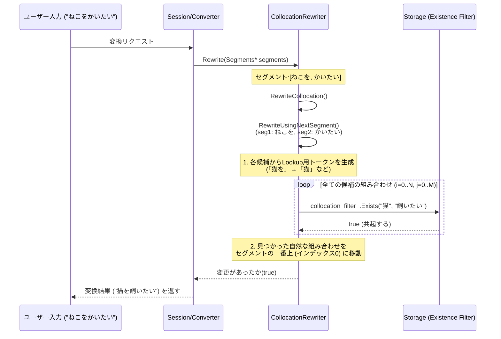

# CollocationRewriter 解説

このドキュメントでは、Mozcにおける `collocation_rewriter` の仕組みと実装について、初学者向けに詳しく解説します。変換候補の中で、「共起関係（よく一緒に使われる言葉の組み合わせ）」を考慮して、自然な日本語になるよう候補の順位を入れ替える（リライトする）機能を提供しています。

## 1. `collocation_rewriter` とは？

日本語入力で変換をする際、複数の形態素（セグメント、文節）に区切って変換されます。
例えば「ねこを」「かいたい」と入力した際、それぞれに候補があります。

* **ねこを**: 「猫を」「ネコを」「寝こを」...
* **かいたい**: 「飼いたい」「買いたい」「解体」...

単独のコスト判定だけだと「猫を解体」となったり「ネコを買いたい」となってしまったりする可能性がありますが、「猫」と「飼う」はよく一緒に使われるというデータ（Collocationデータ）を持っておくことで、「猫を飼いたい」といった自然な結果を上位に引き上げます。このように、隣接するセグメント同士の共起情報を元に候補を並べ替えるのが `CollocationRewriter` の役割です。


## 2. クラス構成とシステム全体の流れ

複数のファイル（機能）がどのように連携して動いているかを視覚化します。




## 3. 各ファイルの役割と主要関数の解説

### 1) リソースファイル
`data_manager/` 등から事前に学習された共起データ (`collocation_data`) と、当て字等の抑制データ (`collocation_suppression_data`) が渡されます。高速かつ省メモリで検索できるように、**Bloom Filter（ブルームフィルタ）** が活用されています（ソースコード上では `ExistenceFilter` と呼ばれています）。
* `CollocationFilter`: 文字列のペアが共起関係にあるかを問い合わせる。
* `SuppressionFilter`: あまり適切でない当て字変換を行わないように抑制するフィルタ。

### 2) `collocation_rewriter.h` (ヘッダファイル)
クラスの定義が行われています。

* `CollocationRewriter`: `RewriterInterface` を継承するメインのクラス。
    * `pos_matcher_`: 品詞情報を判定するオブジェクト。
    * `Rewrite()`: 再変換をかけるメインのエントリポイント。
    * `RewriteCollocation()`: 全てのセグメントをループ処理する親関数。
    * `RewriteUsingNextSegment()`: 次のセグメントの候補をもとに、現在のセグメントの候補順位を補正する。
    * `RewriteFromPrevSegment()`: 前のセグメントの確定した第一候補を用いて、現在のセグメント順位を補正する。

### 3) `collocation_rewriter.cc` (実装の詳細)

ソースコード内の重要な処理を順を追って解説します。

#### ① Token の生成と正規化: `GenerateLookupTokens()`
```cpp
bool GenerateLookupTokens(...)
```
Bloom filter に照会する際、「猫を」や「猫は」といった助詞の違いを吸収するために、ベースの部分(`content_value` = 「猫」)や正規化されたキーへと変換して配列を作ります。品詞や助詞の違い、カナ/漢字の違いなどの揺れを整えます。

#### ② セグメントをまたいだ検証と順位の昇格: `RewriteUsingNextSegment()`
```cpp
bool CollocationRewriter::RewriteUsingNextSegment(Segment* next_seg, Segment* seg) const {
  // 制約として最大kCandidateSize(12個)までしか調べない (速度のため)
  const size_t i_max = std::min(seg->candidates_size(), kCandidateSize);
  const size_t j_max = std::min(next_seg->candidates_size(), kCandidateSize);

  // ... (トークンの事前確保など) ...

  // 全ての組み合わせ (i: 現在のセグメントの候補, j: 次のセグメントの候補) をループ
  for (size_t i = 0; i < i_max; ++i) {
    if (/*コストが高すぎる、名前である、抑制データに載っている場合などはスキップ*/) continue;
    
    for (absl::string_view cur : curs) { // 前のセグメントからのトークン
      for (size_t j = 0; j < j_max; ++j) {
        for (absl::string_view next : nexts[j]) { // 次のセグメントからのトークン
          
          // ブルームフィルタで共起関係があるかをチェック
          if (collocation_filter_.Exists(cur, next)) {
            
            // みつかった！ (ex: cur="猫", next="飼いたい")
            // 両方のセグメントの候補でi番目、j番目だったものを
            // 0番目 (一番最初の変換候補) にリフトアップする
            seg->move_candidate(i, 0);
            next_seg->move_candidate(j, 0);
            
            // CONTEXT_SENSITIVE (文脈依存で昇格された) フラグを付ける
            return true;
          }
        }
      }
    }
  }
  return false;
}
```

#### ③ 全コンテキストの適用範囲: `RewriteCollocation()`
各セグメント毎に隣り合うペア（`seg(i)`, `seg(i+1)`）を取り出して `RewriteUsingNextSegment` を実行します。
また、**「すごい」や「とても」といった副詞が挟まった場合** を考慮する特殊な判定も行なっています。
例えば、「猫を」＋「すごく」＋「飼いたい」の場合、
「すごく」は品詞として副詞であるか (`pos_matcher_.IsAdverb()`) などを判定し、
副詞である場合はインデックスを一つ飛ばして `i-2` と `i` で `RewriteUsingNextSegment` を呼び出し、「猫」＋「飼いたい」の繋がりを評価します。


## 4. 自分で似たようなリライトの機能を実装するためには？

もし、独自の書き換えルールを追加したい場合、以下のステップを踏むことになります。

1. **`RewriterInterface` を継承したクラスを作る:**
   `MyCustomRewriter` などを定義します。
2. **`Rewrite()` メソッドをオーバーライドする:**
   `bool Rewrite(const ConversionRequest& request, Segments* segments) const override;` を実装します。
   引数の `segments` がポインタとして渡されるため、中で `segment->candidate(i)` を読んだり `segment->move_candidate(i, 0)` を実行することで、破壊的に候補順位を入れ替えることができます。
3. **コストとスコアの判定ロジックを用意する:**
   Collocation のように何らかの辞書(Hash Map や Bloom Filter など)を検索し、条件を満たしたときのみ `move_candidate()` で候補を上に持ち上げます。
   この際、本来コストがとてつもなく高い（1番目と比べて例えばコスト差が3000以上あるなど）通常あり得ない変換はリフトアップしないようにガードを仕掛けると安全です (`kMaxCostDiff` のような変数を用意)。
4. **`rewriter/rewriter.cc` などのエンジン生成部分で登録する:**
   作成した Rewriter を Mozc エンジンのパイプライン (Rewriter のリスト) に組み込むことで実行されるようになります。
