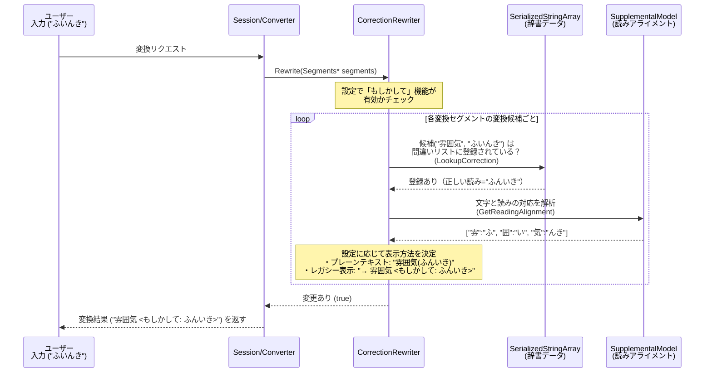

# CorrectionRewriter 解説

このドキュメントでは、Mozcにおける `correction_rewriter` の仕組みと実装について、初学者向けに詳しく解説します。ユーザーが**誤った読み方**（例：「ふいんき」）を入力してしまった場合に、**正しい読み方と変換結果**（例：「雰囲気 <もしかして: ふんいき>」）を提示する、「もしかして」機能（スペル訂正機能）を提供しています。

## 1. `correction_rewriter` とは？

「読み間違い」や「入力ミス」を補正するためのモジュール（Rewriter）です。
よくある読み間違い（例：「すくつ」→「巣窟（そうくつ）」、「ふいんき」→「雰囲気（ふんいき）」）などの組み合わせデータを持ち、変換中の候補にそれらの単語が現れた場合、正しい読み方のサジェストを表示したり、正しい候補を自動的に追加したりします。

## 2. クラス構成とシステム全体の流れ

この機能がどのようにユーザーの入力を補正しているか、全体の流れを視覚化します。



## 3. 各ファイルの役割と主要関数の解説

### 1) リソースファイルとデータの持ち方
`CorrectionRewriter` は、あらかじめコンパイルされた3つの配列データを `DataManager` 経由で受け取ります。
1. `value_array_`: 変換結果（例："雰囲気"）
2. `error_array_`: 間違った読み（例："ふいんき"）
3. `correction_array_`: 正しい読み（例："ふんいき"）

これらは `SerializedStringArray` という省メモリかつ高速に検索可能なデータ構造で保持されており、内部では二分探索（`std::equal_range`）を用いて「間違った読み」から素早く検索できるようになっています。

### 2) `correction_rewriter.h` (ヘッダファイル)
クラスの定義が行われています。

* `CorrectionRewriter`: メインとなるクラス。
* `ReadingCorrectionItem` 構造体: 検索語見つかった（値、誤り、訂正）の3つの文字列を保持する一時的なデータクラス。

### 3) `correction_rewriter.cc` (実装の詳細)

ソースコード内の重要な処理を解説します。

#### ① リライトのメイン処理: `Rewrite()`
```cpp
bool CorrectionRewriter::Rewrite(const ConversionRequest& request, Segments* segments) const {
  // 1. 設定で「もしかして機能」がオフなら何もしない
  if (!request.config().use_spelling_correction()) return false;

  // 2. セグメントと候補のループ
  for (Segment& segment : segments->conversion_segments()) {
    // ...
```
メインの処理です。まず機能が有効かを確認し、セグメント（文節など）と変換候補を一つ一つ調べていきます。

#### ② 辞書の検索: `LookupCorrection()`
```cpp
bool CorrectionRewriter::LookupCorrection(
    const absl::string_view key, const absl::string_view value,
    std::vector<ReadingCorrectionItem>* results) const {
```
入力された `key` ("ふいんき") と `value` ("雰囲気") をもとに、`error_array_` から二分探索 (`std::equal_range`) で該当データを高速に探し出します。見つかったら `results` 配列に格納します。

#### ③ セグメントへの情報追加と新規候補の挿入
`Rewrite()` 内の後半では、検索で見つかった結果を用いて以下の2つのことを行います。

1. **既存候補の説明文のアップデート:**
   「ふいんき」→「雰囲気」という変換候補がすでに存在する場合、その候補に `<もしかして: ふんいき>` という `description`（注釈）や `SPELLING_CORRECTION` 属性を追加します。
2. **正しい候補の追加:**
   もし1番目の候補（トップ候補）自体が「読み間違い」を含む単語だった場合、その訂正版の候補を新しく作り、セグメントの目立つ位置（上位3番目以内）に挿入 (`insert_candidate`) します。これにより、ユーザーは訂正された単語を容易に選ぶことができます。

#### ④ 表示形式の調整: `GetDisplayValueForReadingCorrection()`, `SetCandidate()`
```cpp
void CorrectionRewriter::SetCandidate(const ReadingCorrectionItem& item, ...)
```
クライアントの能力（UIがどのような表示をサポートしているか）に応じて、表示方法を切り替えます。
* クライアントがインラインでのリッチテキスト表示などに対応している場合、`SupplementalModel` にお伺いを立てて、文字ごとの対応箇所（アライメント）を取得します。例えば、「ふ」と「雰」、「んき」と「気」の違いを見つけ出し、ユーザーに `雰囲気(ふんいき)` のように**どこが違っていたか**がピンポイントでわかるように `display_value` を構成します。
* レガシーな環境の場合は `<もしかして: ふんいき>` を `description` として付与します。


## 4. 似たような Rewriter（リライタ）を作るには？

「特定の単語に対して警告を出す」「特定の入力のときだけおまけの情報を付与する」といった機能を作りたい場合、このファイルは非常に良い参考になります。

1. **クラスの作成:** `RewriterInterface` を継承したクラスを作成し、`Rewrite()` を実装する。
2. **有効無効の判定:** `request.config()` をチェックし、ユーザー設定により動作をオン・オフできるようにする。
3. **候補の走査と検索:** `segments->conversion_segments()` をループして、ターゲットとなる単語を何らかのデータ表（配列やハッシュマップ）から探す。
4. **属性の付与:** 見つかった場合、`candidate->attributes |= converter::Attribute::SPELLING_CORRECTION` のように属性を追加し、`candidate->description` などを書き換える。
5. **候補の追加:** 新しい変換候補を足したい場合は、`std::make_unique<Candidate>(...)` で作成し `segment.insert_candidate()` で追加する。

`correction_rewriter` は、**「既存の候補に説明やフラグを付与する」「新しい候補を作り出して挿入する」の2つの働きを持つ**のが特徴です。独自のサジェスト機能を作りたい場合のお手本として最適です。
