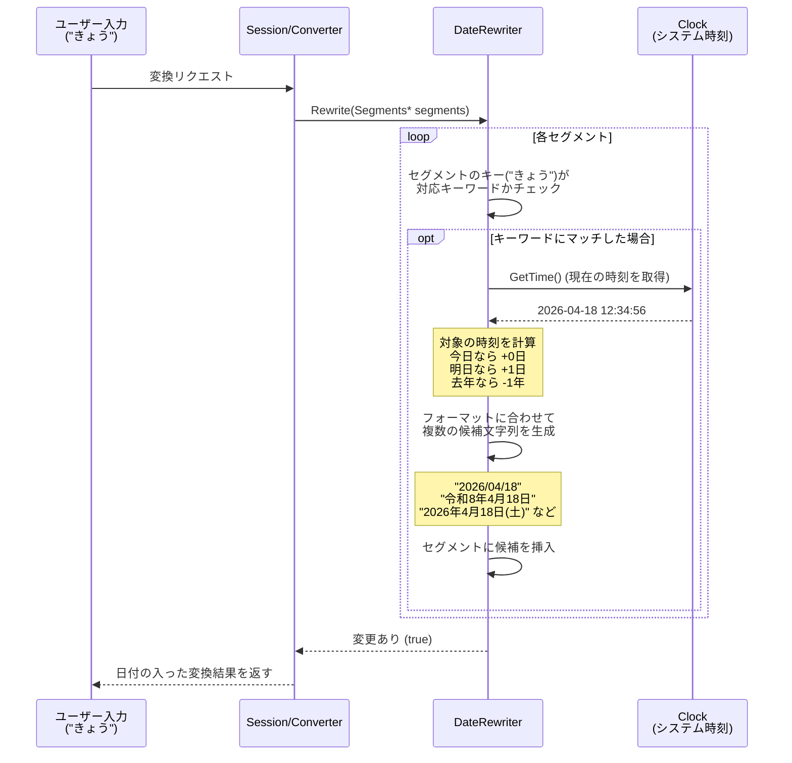

# DateRewriter 解説

このドキュメントでは、Mozcにおける `date_rewriter` の仕組みと実装について、初学者向けに詳しく解説します。この機能は、ユーザーが「きょう」や「いま」といった関連ワードを入力したときに、現在の日付や時刻を変換候補として提示する機能を提供しています。

## 1. `date_rewriter` とは？

入力された特定のキーワード（「きのう」「あした」「ことし」「いま」など）を検知し、PCやスマホの現在のシステム時刻をもとに、日付や時刻、年号などに変換してサジェストするRewriterです。
例えば、「きょう」と打つと「2026/04/18」や「令和8年4月18日」などが候補に現れます。

## 2. システム全体の流れ

ユーザーが「きょう」と入力した際の流れを視覚化します。



## 3. データの持ち方と主要処理の解説

### 1) 対応キーワードと種別の定義
コードの先頭付近に `kDateData` という配列が定義されており、ここで「どのキーワードが入力されたら、どの種類（日付か、年か、時刻か）の計算をするか」が管理されています。

```cpp
constexpr DateRewriter::DateData kDateData[] = {
    // 日付に関する変換（0は当日、1は翌日、-1は前日）
    {"きょう", "今日", "今日の日付", 0, DATE},
    {"あした", "明日", "明日の日付", 1, DATE},
    {"さくじつ", "昨日", "昨日の日付", -1, DATE},
    
    // 曜日に関する変換（0は次の月曜日、1は火曜日...）
    {"げつようび", "月曜日", "次の月曜日", 0, WEEKDAY},
    
    // 年に関する変換（0は今年、1は来年）
    {"ことし", "今年", "今年", 0, YEAR},
    {"らいねん", "来年", "来年", 1, YEAR},
    
    // 時刻に関する変換
    {"いま", "今", "現在の時刻", 0, CURRENT_TIME},
};
```

他にも、西暦から和暦（令和、平成など）や干支を計算するため、長大な `kEraData`（大化の改新から現在までの年号リスト）などの辞書データが含まれています。

### 2) `Rewrite()` での候補生成
`Rewrite` 関数の中で、文字列がキーに合致すると、`ClockUtil` を用いて現在の時刻を取得し、種別（`DATE` や `YEAR` など）ごとに専用のフォーマット関数に渡します。

例えば `DATE` の場合:
今日から `diff` 日分だけ日数を加減算した新しい日付を作り、以下のような様々なフォーマット済み文字列を一気に大量に作成します。
* `YYYY/MM/DD` (例: 2026/04/18)
* `YYYY年MM月DD日` (例: 2026年04月18日)
* `和暦Y年M月D日` (例: 令和8年4月18日)
* `M月D日(W)` (例: 4月18日(土))

### 3) 学習させない工夫
作られた候補を `segment->insert_candidate()` で追加する際、`converter::Attribute::NO_LEARNING` というフラグが付けられます。
これは「今日＝2026/04/18」であることをMozcのユーザー辞書が学習してしまうと、明日「きょう」と打った時にも昨日の日付である「2026/04/18」が第一候補に出てきてしまうため、それを防ぐための重要な仕組みです。

## 4. 似たような機能を作るには？

「特定のコマンド文字列に反応して、システムの状態（時間や乱数など）を動的に展開してサジェストする」機能が作れます。

1. **キーワードの検知:** まずは `segments->conversion_segment(i).key()` が自分の反応したい文字列（例えば「てんき」や「ばーじょん」など）かチェックする。
2. **動的コンテンツの取得:** システムから現在時刻やバージョン番号などの情報を取得する。
3. **候補の挿入:** `segment->insert_candidate()` で新しい候補を追加し、内容を書き換える。
4. **学習機能の無効化:** ここで生成した候補をMozcが学習してしまわないように `candidate->attributes |= converter::Attribute::NO_LEARNING;` を必ずセットする。
