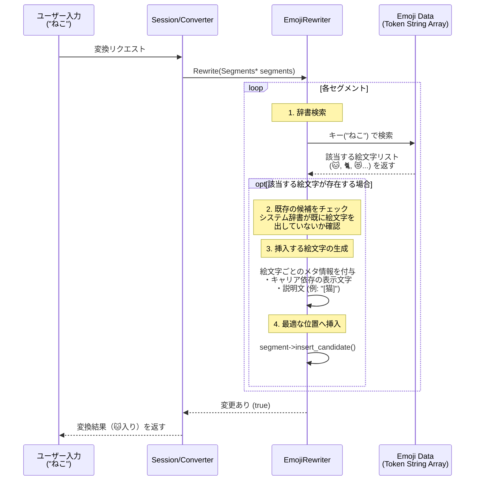

# EmojiRewriter 解説

このドキュメントでは、Mozcにおける `emoji_rewriter` の仕組みと実装について初学者向けに詳しく解説します。この機能は、ユーザーが「えごお」や「ねこ」、「ハート」などの読みを入力した際に、対応する絵文字（「🐱」「💖」など）を変換候補として表示する役割を持っています。

## 1. `emoji_rewriter` とは？

スマートフォンやPCで標準的に使われている「絵文字 (Emoji)」を、全角かな/半角カナの入力からサジェストするためのモジュールです。  
内部で強力な絵文字辞書を持っており、キーワード（「すまいる」など）だけでなく、そのカテゴリ（「顔文字」「感情」など）や、Unicodeの表現形式（「U+1F600」など）といったメタデータを扱い、適切なプラットフォーム上で正しい絵文字を表示させます。

## 2. システム全体の流れ

ユーザーが「ねこ」と入力した際の流れを視覚化します。



## 3. 各ファイルの役割と主要関数の解説

### 1) 絵文字データ（辞書）の仕組み
`symbol_rewriter` と同様に、大量の絵文字データは `gen_emoji_rewriter_data.py` というスクリプトによって、ビルド時にC++のコード (`emoji_rewriter_data.h`) へと変換・埋め込まれます。
これには、各絵文字の「読み（キー）」「Unicode値」「Android/iOSなどのプラットフォームごとの対応」「説明文（description）」がバイナリ配列としてシリアライズされています。

### 2) `emoji_rewriter.cc` の主な処理

#### ① 機能のオン/オフ: `capability()` と `Rewrite()`
ユーザー設定で「絵文字変換を有効にする」というオプションが提供されている場合や、そもそも動作している環境（例: 古いOSで絵文字が表示できない）に応じて、絵文字のRewriterを動作させるかどうかを判定します。

#### ② 辞書の検索処理:
入力された文字列 (`segment->key()`) をもとに、シリアライズされた絵文字データを検索 (`std::equal_range` など) します。
複数の絵文字が登録されている（「ハート」には赤や青や割れたハートなど多数ある）ため、見つかった一覧（イテレータの範囲）を取得します。

#### ③ キャリア/環境ごとの文字コード変換:
絵文字は、Unicodeの標準化が進む過程において「ドコモ」「au」「SoftBank」の各キャリア独自文字であった時代があり、今でもOS環境によっては特定の文字コードで出力する必要があります。機能内部には、Unicodeと各キャリアの文字コードとのマッピング変換処理などが含まれており、**現在動作している環境に最適な値 (`value`)** を生成します。

#### ④ 候補への挿入処理: 
見つかった絵文字をリストの下部や特定のオフセット位置に挿入します。
```cpp
// 概要イメージ
for (auto iter = range.first; iter != range.second; ++iter) {
  auto candidate = std::make_unique<Candidate>();
  candidate->value = iter->value;               // "🐱"
  candidate->content_value = iter->value;       // "🐱"
  candidate->description = iter->description;   // "[猫]"
  candidate->attributes |= Attribute::NO_LEARNING; // 学習しない
  
  // 丁度良い位置に挿入する
  segment->insert_candidate(insert_pos, std::move(candidate));
}
```
また、絵文字も一時的な感情表現として使われることが多いため、「ねこ＝🐱」であることをユーザー辞書が強く学習しすぎて「猫」という漢字が出なくなることを防ぐため、`NO_LEARNING` 属性が付与されます。


## 4. 似たような機能を作るには？

「テキストの読みから、リッチテキストや特殊な文字コード（Unicode絵文字、環境依存文字、外字など）を呼び出して変換する」際に参考となる実装です。

1. **膨大なメタデータの扱い:** 単なる「読み→文字」の変換にとどまらず、「この環境では表示できるか？」「説明文はどうするか？」といった複数のメタデータを1つの構造体（またはTSVからの生成データ）にまとめて持たせる手法。
2. **プラットフォーム非依存の設計:** MozcはWindows, Mac, Linux, Androidなど様々な環境で動くため、文字コードの扱い（サロゲートペアや独自領域）を適切に切り分ける必要がある場合の実装例。
3. **学習除外と挿入位置:** 頻発する短い読み（「かお」「あせ」など）で出た特殊な候補を、どうすれば邪魔にならないように制御するかの工夫。