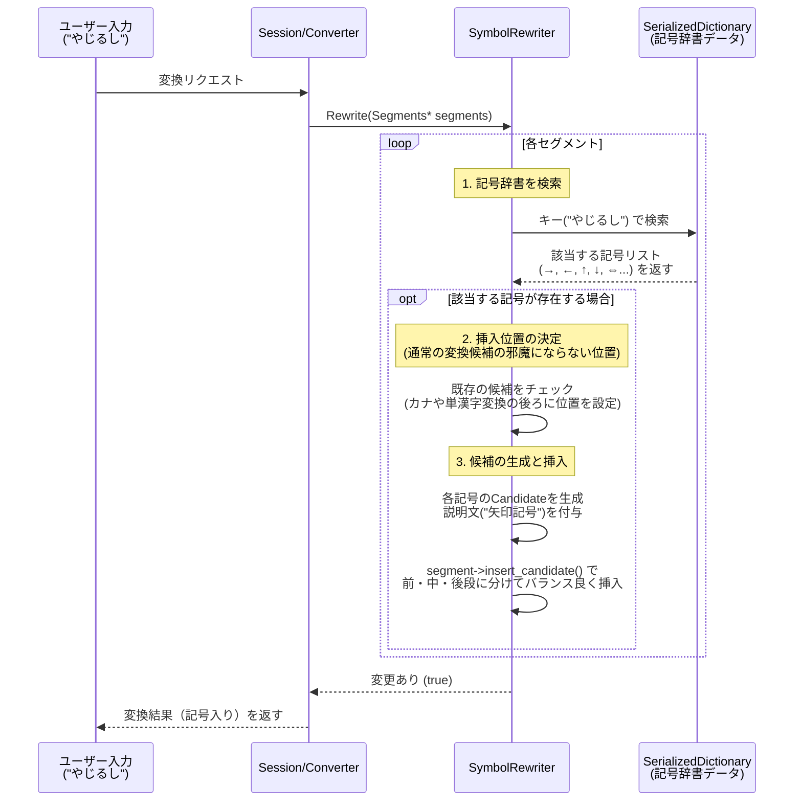

# SymbolRewriter 解説

このドキュメントでは、Mozcにおける `symbol_rewriter` の仕組みと実装について初学者向けに詳しく解説します。この機能は、ユーザーが「きごう」や「やじるし」、「まる」などを入力した際に、環境依存文字や各種記号（「★」「→」「①」など）を変換候補として提供する役割を持っています。

## 1. `symbol_rewriter` とは？

「きごう」「やじるし」「ギリシャ」といった特定の読みを入力したときに、辞書データに登録されている様々な「記号」の変換候補を生成・追加するモジュール（Rewriter）です。変換精度を落とさないよう、通常の単語変換の邪魔にならない位置（オフセット位置）に記号候補を上手くバラまいて挿入する工夫がなされています。

## 2. システム全体の流れ

ユーザーが「やじるし」と入力した際の流れを視覚化します。

## 3. 各ファイルの役割と主要関数の解説

### 1) 辞書データとツールの関係
記号のデータはソースコード内にハードコードされているわけではありません。
* `data/symbol/symbol.tsv` に記号の一覧（読み、記号、説明）が定義されています。
* ビルド時に `gen_symbol_rewriter_dictionary_main` というツールが走り、高速に検索可能なデータ (`SerializedDictionary`) へと変換されます。
* 実行時、`SymbolRewriter` はこのシリアライズされた辞書 (`dictionary_`) を検索します。

### 2) `symbol_rewriter.cc` の主な処理

#### ① 記号の検索: `Rewrite()` 
入力された読み (`segment->key()`) を用いて、`dictionary_->equal_range(key)` で辞書から該当する記号のリストを一括で取得します。

#### ② 既存候補への説明文付与: `AddDescForCurrentCandidates()`
Mozcの通常のシステム辞書によって既に記号が出力されている場合（例：「やじるし」の通常変換で最初から「→」が出ている場合）、その通常の候補に対して `(矢印記号)` のような説明文 (`description`) だけを後付けで付与します。

#### ③ 挿入位置の計算: `InsertCandidates()`
記号をたくさん追加すると、ユーザーが本当に探していた一般単語（例：「矢印」という漢字そのもの）が記号の山に埋もれてしまいます。そのため、挿入位置を細かく制御します。

* 基本の挿入位置(`kDefaultOffset = 3`)から開始します。
* 既存の「単漢字」や「カタカナ」といった重要な候補があれば、その分だけ挿入位置（`offset`）をさらに後ろへずらして、通常の変換候補を優先します。

#### ④ レア記号の降格: `IsRareSymbolForDemotion()`
「ヒエログリフ」や「変体仮名」のような、特殊で日常的にはほとんど使われない記号が大量に出るのを防ぐため、これらが検索にヒットした場合は、候補リストの「一番最後（ボトム）」に追いやる（Demotion）処理が入っています。

#### ⑤ 複数箇所への分散挿入 
見つかった記号リスト（数十個になることもあります）を一度に同じ場所に挿入すると画面が記号で埋め尽くされてしまいます。
そのため、最初の15個（`kMaxInsertToMedium`）くらいまでは中間の位置に挿入し、それ以降に続く記号については、さらに後ろ（`1.5倍`の位置から開始）のほうへ分散して挿入するというテクニックが使われています。

## 4. 似たような機能を作るには？

「特定の名前やカテゴリ名を入力したときに、外部の辞書ファイルにマッピングされた大量の候補（例：顔文字、特殊絵文字、定型文など）を展開したい」場合に非常に参考になる実装です。

1. **外部データの準備:** TSVなどのテキストデータを用意し、ビルド時に配列や `SerializedDictionary` に固めるツールを作る。
2. **`Rewrite()` の実装:** `RewriterInterface` を継承したクラスを作成し、入力キーで構築した辞書を検索する。
3. **挿入位置のアライメント:** `RewriteUtil::CalculateInsertPosition` などを活用して、**上位（1番目、2番目）の変換候補を潰さない**・**大事な単語を押し除けない** 絶妙な位置を見つける。
4. **説明の付与:** ユーザーが「これは何？」と迷わないように `candidate->description` に注釈を設定する。